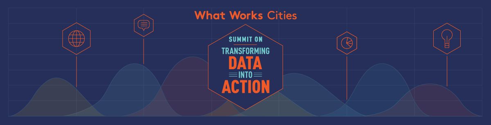

##  WWC Summit on Transforming Data into Action

Below are links to materials and presentations from the 2016 WWC Summit on Transforming Data into Action.

<ul class="list-group">
<li class="list-group-item">
  <h4>General Summit Information</h4>
  
General information about the summit

  
<a href="/summit-materials/Welcome Letter - 230.pdf">Welcome Letter</a>

  
<a href="/summit-materials/Folder - Narrative Agenda_230, stapled.pdf">Summit Agenda</a>

  
<a href="/summit-materials/WWCSummit-AnalyticsWorkshopBios.pdf">Workshop Biographies</a>

</li>

<li class="list-group-item">
  <h4>Preventing Adverse Police Interactions - Charlotte, NC</h4>
  
Thisprojectuses d atasciencetoimprovethepolicedepartment’sEarlyIntervention System (EIS) by figuring out which of Charlotte’s 1,800 officers are likely to have an adverse interaction in the next two years.

  
<a href="/summit-materials/S1_CriminalJustice_Summary.pdf">Summary</a>

  
<a href="/summit-materials/S1_CriminalJustice_Prez.pdf">Presentation</a>

</li>

<li class="list-group-item">
  <h4>Food Inspection Forecasting - Chicago, IL</h4>
  
The Chicago Department of Public Health (CDPH), Department of Innovation and Technology (DOIT), Allstate Insurance, and Civic Consulting Alliance developed a predictive model that allowed the City to reduce residents’ exposure to foodborne illnesses.

  
<a href="/summit-materials/S2_FoodInspections_Summary.pdf">Summary</a>

  
<a href="/summit-materials/S2_Health_Prez.pdf">Presentation</a>

</li>

<li class="list-group-item">
  <h4>Preventing Childhood Lead Poisoning - Chicago, IL</h4>
  
Data Science for Social Good (DSSG) developed a predictive model to determine the risk of a child being poisoned by lead. This model encouraged city inspectors to prioritize potential hazards and identify children most at risk.

  
<a href="/summit-materials/S2_LeadPoisoning_Summary.pdf">Summary</a>

  
<a href="/summit-materials/S2_Health_Prez.pdf">Presentation</a>

</li>

<li class="list-group-item">
  <h4>College Readiness - Montgomery County, MD and Mesa, AZ</h4>
  
City governments often don’t have direct control over education. Focusing on data and analytics capacity is one way for cities to engage with education-related initiatives, especially as they may relate to other city services, such as public safety, parks and recreation, and neighborhood and community services. Cities should also consider applying this study’s method in other areas where identifying risk is important to service provision.

  
<a href="/summit-materials/S3_Education_Summary.pdf">Summary</a>

  
<a href="/summit-materials/S3_Education_Prez.pdf">Presentation</a>

</li>

<li class="list-group-item">
  <h4>Preventing HIV Transmissions - Washington, DC</h4>
  
This project combined executive commitment and leadership strategy driven by data and evidence to reduce HIV infections and improve outcomes of persons living with AIDS in DC. Through the use of data three critical accomplishments were made in the fight against the epidemic: 1) An overall 57% decrease in newly diagnosed rate and 87% reduction in the number of newly diagnosed HIV cases attributable to injection drug use. (In 2007, prior to the scale up of DC’s needle exchange program, there were 149 cases compared to 19 in 2013.) 2) Total prevention of mother-to-child transmission (i.e, no babies born with HIV). 3) Reduced overall prevalence rate from 3.2% in 2010 to 2.5% in 2013.

  
<a href="/summit-materials/S4_HIV_Summary.pdf">Summary</a>

  
<a href="/summit-materials/S4_HIV_Prez.pdf">Presentation</a>

</li>

<li class="list-group-item">
  <h4>Probabilistic Modeling for Code Violations - Cincinnati, OH</h4>
  
The City of Cincinnati and the Data Science for Social Good (DSSG) team are helping code inspectors prioritize properties likely to have a significant code violation. By predicting future violations, they can reduce unnecessary inspections and get to problem properties early, before significant damage to the property occurs. Preliminary results indicate that the “discovery rate,” or the rate at which inspections result in discovery of an actual violation, could increase by more than 30% by using the model developed by the team.

  
<a href="/summit-materials/S5_Cincy_Summary.pdf">Summary</a>

  
<a href="/summit-materials/S5_Blight_Prez.pdf">Presentation</a>

</li>

<li class="list-group-item">
  <h4>Code Violation Decision Tool - New Orleans, LA</h4>
  
New Orleans has done major work to reduce the number of properties with code violations and improve quality of life in neighborhoods. It used data science to create a decision tool, which helped city staff expedite the removal of unoccupied structures with major deterioration from neighborhoods through either strategic demolition or sale of the property. The decision to either demolish or sell a property is a highly political and visible one, and the tool helped to add rigor and transparency to the decision-making process. It also resulted in staff eliminating a backlog of 1,400 properties requiring a decision in just 3 months. This type of analytical tool could apply to any process where staff are required to make a large volume of similar decisions.

  
<a href="/summit-materials/S5_NOLA_Summary.pdf">Summary</a>

  
<a href="/summit-materials/S5_Blight_Prez.pdf">Presentation</a>

</li>

<li class="list-group-item">
  <h4>Reducing Fire Risk and Fire Fatalities - New Orleans, LA and New York, NY</h4>
  
New Orleans and New York optimized their use of internal and external data to increase the effectiveness of inspection and prevention programs to save lives and property.

  
<a href="/summit-materials/S6_Fire_Summary.pdf">Summary</a>

  
<a href="/summit-materials/S6_Fire_Prez.pdf">Presentation</a>

</li>

<li class="list-group-item">
  <h4>Launching Performance Management: JackStat - Jackson, MS</h4>
  
At the first JackStat meeting the JPD reported saving more than $525,792 in FY 2015 by property owners voluntarily cleaning up their properties after receiving a letter from the department. Jackson now continues to hold biweekly JackStat meetings after the first meeting was rated “very useful” by 57.1% of participants “somewhat useful” by 42.9%.

  
<a href="/summit-materials/S7_Launching_Summary.pdf">Summary</a>

  
<a href="/summit-materials/">Presentation</a>

</li>

<li class="list-group-item">
  <h4>Priority Performance Management: HALAStat - Seattle, WA</h4>
  
Seattle piloted a performance management program by developing a data collection framework, key performance indicators, and meeting structure required to support a key priority for the City: The Housing Affordability and Livability Agenda (HALA).

  
<a href="/summit-materials/S7_Prioritizing_Summary.pdf">Summary</a>

  
<a href="/summit-materials/">Presentation</a>

</li>

<li class="list-group-item">
  <h4>Rebooting Performance Management: DepartmentStat - Kansas City, MO</h4>
  
Kansas City rebooted their KCStat program by creating DepartmentStat, which applies a data-driven emphasis to departments’ priorities. Now, department goals are linked to citywide goals covered by KCStat. Departments have an opportunity to learn how their peers are improving data-driven decision making. DepartmentStat gives more visibility to departments, leadership, and the Office of Performance Management around the interconnection across departments, and opportunities for collaboration.

  
<a href="/summit-materials/S7_Rebooting_Summary.pdf">Summary</a>

  
<a href="/summit-materials/">Presentation</a>

</li>

</ul>
